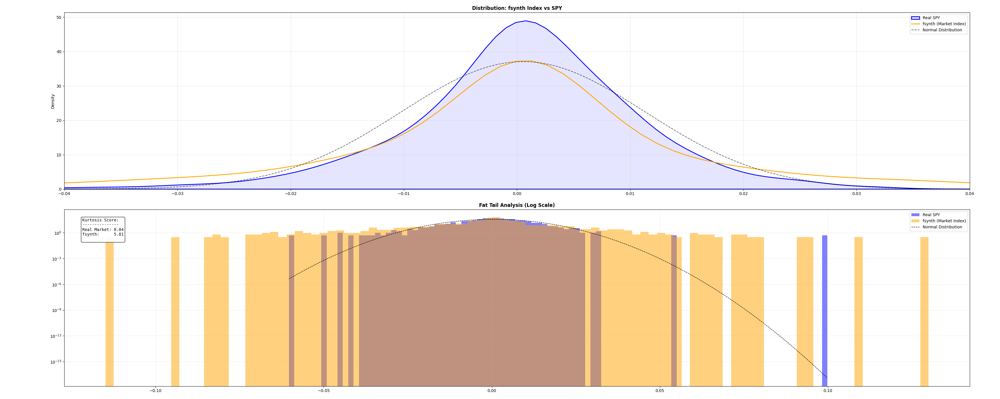

# fsynth: High-Fidelity Synthetic Financial Data Generator

[](https://badge.fury.io/py/fsynth)
[](https://opensource.org/licenses/MIT)
[](https://www.python.org/downloads/)
[]()
[](https://welcra.com/fsynth.pdf)

**fsynth** is a high-performance Python library for generating realistic, multi-asset financial time series and corresponding fundamental reports. Unlike simple geometric brownian motion (GBM) generators, `fsynth` models the complex statistical properties of real markets—including volatility clustering, fat tails, and regime-dependent correlations—using **Heston Stochastic Volatility** and **Merton Jump Diffusion** processes.

Designed for quantitative researchers, AI/ML engineers, and financial educators who need massive, clean, and statistically rigorous datasets for backtesting and model training.

---

## 🚀 Features

* **Stochastic Volatility:** Implements the Heston model to simulate time-varying volatility, capturing the "volatility smile" and clustering observed in real markets.
* **Regime Switching:** Simulates macro-economic states (Bull, Bear, Crisis) that dynamically alter correlation matrices and volatility baselines.
* **Jump Diffusion:** Incorporates Poisson-distributed price jumps to model market shocks (Merton model).
* **Linked Fundamentals:** Generates coherent 10-Q/10-K style fundamental data (Revenue, EBITDA, EPS, Debt) that correlates with the stock's price performance and sector genes.
* **High Performance:** Core simulation kernels are JIT-compiled using `numba` for C-level speeds, allowing for the generation of millions of rows in seconds.
* **Parquet Native:** Outputs optimized Parquet files ready for ingestion into Pandas, Polars, or PySpark.

---

## 📊 Why use fsynth? (The "Fat Tail" Problem)

Standard financial models (Geometric Brownian Motion) assume market returns are Normally Distributed. They fail to capture "Black Swan" events.

**fsynth is different.** It captures the "Fat Tails" (extreme crashes) observed in real markets.



* **Real SPY Kurtosis:** ~8.04 (High risk of crash)
* **Standard Model:** ~0.00 (Assumes crashes are impossible)
* **fsynth Model:** ~5.81 (Successfully models crash risk)

---

## 📦 Installation

```bash
pip install fsynth
```

Or build from source:

```bash
git clone https://github.com/welcra/fsynth.git
cd fsynth
pip install -e .
```

---

## ⚡ Quick Start

### 1. The Command Line Interface (CLI)

The easiest way to generate a dataset is using the bundled CLI tool. **New in v0.1.1:** You can now tune the Heston volatility and Jump Diffusion parameters directly from the command line to simulate different market conditions (e.g., "Crypto Winter" vs. "Stable Bull Market").

**Generate a standard SPY-like dataset (Stable, rare crashes):**

```bash
fsynth-gen --stocks 500 --years 10 --out data --theta 0.02 --lambda_j 0.05
```

**Generate a high-volatility "Crypto" dataset (Frequent 5% crashes):**

```bash
fsynth-gen --stocks 100 --years 5 --theta 0.10 --lambda_j 0.50 --crash_size -0.05
```

New CLI Flags:
- ```--theta```: Baseline volatility (Long-run variance). Lower (0.02) = Stable, Higher (0.10) = Volatile.
- ```--lambda_j```: Jump intensity (Expected jumps per year).
- ```--crash_size```: Average size of a jump (e.g., -0.05 is -5%).
- ```--crisis_prob```: Daily probability of switching to a high-correlation "Crisis" regime.

Output:
- ```data/market_index.parquet```: The macro-economic backbone (regimes, risk-free rates).
- ```data/stock_prices.parquet```: OHLCV data for all 500 tickers (~1.2M rows).
- ```data/fundamentals.parquet```: Quarterly financial reports for all tickers.

### 2. Python API

For integration into your own scripts or data pipelines, MarketConfig now accepts dynamic parameters for fine-grained control:

```python
from fsynth import MarketConfig, MarketSimulator, FundamentalGenerator
import pandas as pd

# 1. Configure the Simulation (v0.1.1 Update)
config = MarketConfig(
    T=5,                # Years
    dt=1/252,           # Daily time steps
    n_stocks=100,       # Number of tickers
    n_sectors=5,        # Distinct sectors
    seed=42,            # Reproducibility
    
    # -- New Tuning Parameters --
    theta0=0.02,        # Low baseline volatility (SPY-like)
    lambda_j=0.05,      # ~12 jumps per year
    mu_j=-0.02,         # Average jump size is -2%
    p_01=0.005          # 0.5% chance of entering Crisis regime daily
)

# 2. Run the Engine
sim = MarketSimulator(config)
print("Generating Market Backbone...")
market_df = sim.generate_market()

print("Generating Asset Paths...")
stock_dfs = sim.generate_stocks()

# 3. Aggregate Data
all_prices = pd.concat(stock_dfs.values(), ignore_index=True)
metadata = pd.DataFrame([
    {'Ticker': k, 'Sector': v['Sector'].iloc[0]} 
    for k, v in stock_dfs.items()
])

# 4. Generate Fundamentals
print("Generating 10-Q Reports...")
fund_gen = FundamentalGenerator(market_df, metadata, seed=config.seed)
fundamentals_df = fund_gen.generate_reports()

print(f"Generated {len(all_prices)} price rows and {len(fundamentals_df)} reports.")
```

---

## 🧮 Mathematical Methodology

`fsynth` moves beyond standard Random Walk theories to capture the nuanced risks of real financial markets.

### The Heston Model
We model the spot price $S_t$ and its variance $v_t$ using the following system of stochastic differential equations (SDEs):

$$dS_t = \mu S_t dt + \sqrt{v_t} S_t dW_t^S$$

$$dv_t = \kappa(\theta - v_t)dt + \xi \sqrt{v_t} dW_t^v$$

Where:
* $\theta$ is the long-run average variance.
* $\kappa$ is the rate of mean reversion.
* $\xi$ is the volatility of volatility (vol-of-vol).
* $dW_t^S$ and $dW_t^v$ are Brownian motions with correlation $\rho$.

### Regime Switching & Jump Diffusion
To model market crashes and shocks (fat tails), we introduce a Poisson jump process $J$:

$$ \frac{dS_t}{S_t} = (\mu - \lambda k)dt + \sigma dW_t + dJ_t $$

A Hidden Markov Model (HMM) governs the transition between `Bull`, `Bear`, and `Crisis` regimes, automatically adjusting parameters $\mu$, $\sigma$, and jump intensity $\lambda$ in real-time.

---

## 📂 Data Structure

### Stock Prices (OHLCV)
| Date | Ticker | Open | High | Low | Close | Volume | Regime |
|------|--------|------|------|-----|-------|--------|--------|
| 2023-01-01 | STK_001 | 100.0 | 101.2 | 99.5 | 100.8 | 150240 | Bull |

### Fundamentals (Quarterly)
| Date | Ticker | Revenue | EBITDA | EPS | Debt | RegimeEnv |
|------|--------|---------|--------|-----|------|-----------|
| 2023-03-31 | STK_001 | 450.20 | 112.50 | 2.10 | 300.00 | 0.12 |

---

## 🤝 Contributing

Contributions are welcome! Please open an issue to discuss proposed changes or submit a Pull Request.

1.  Fork the repository.
2.  Create your feature branch (`git checkout -b feature/AmazingFeature`).
3.  Commit your changes (`git commit -m 'Add some AmazingFeature'`).
4.  Push to the branch (`git push origin feature/AmazingFeature`).
5.  Open a Pull Request.

---

## 📜 Citing fsynth
If you use fsynth in your research, please cite the following preprint:

> Malhotra, A. (2025). *High Fidelity Synthetic Financial Universes Through Regime Switching With Stochastic Volatility and Jump Diffusion*. SSRN.

**Key Findings:**
* **Kurtosis Benchmark:** While the industry-standard GARCH(1,1) model produces an excess kurtosis of only **0.33**, `fsynth` achieves **5.79**, closely matching the S&P 500's **8.05**.
* **Solvency Modeling:** Demonstrated ability to simulate "Death Spirals" where macro-regimes trigger reflexive debt crises in high-leverage assets.

[Read the Full Paper (PDF)](https://welcra.com/fsynth.pdf)

## 📄 License

Distributed under the MIT License. See `LICENSE` for more information.

---

**Built by [Arnav Malhotra](https://welcra.com/).**
